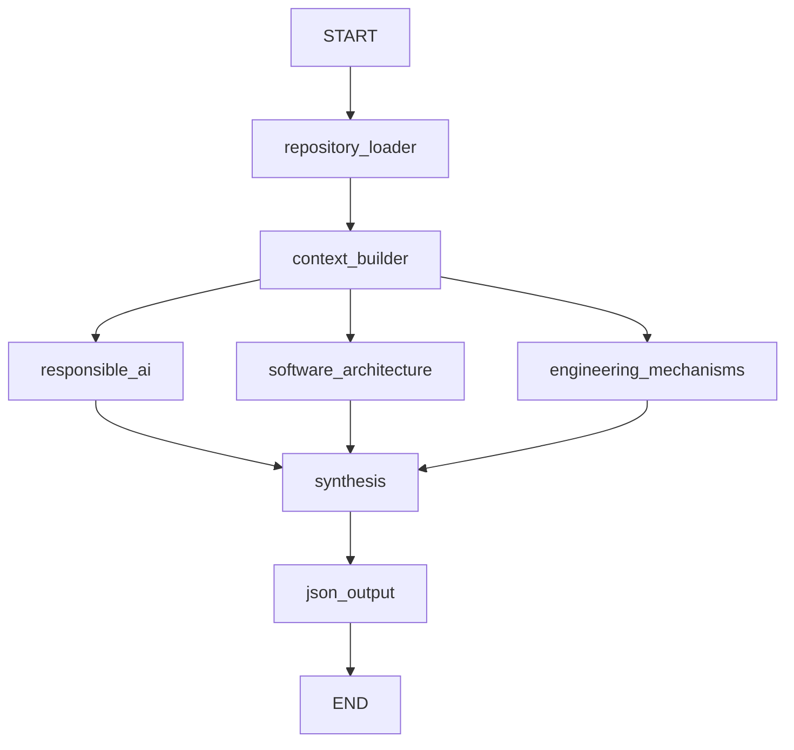

# AI Judge — avaliação técnica de repositórios

API FastAPI que analisa um commit de um repositório GitHub com LangChain e
LangGraph. Três avaliadores independentes atribuem notas de 0 a 2 para Responsible
AI, arquitetura de software e mecanismos de engenharia. Cada nota positiva exige
evidência literal de código/configuração apresentada ao avaliador.

A implementação segue a organização do
[agent-advisor de referência](https://github.com/Leonardojdss/agent-account-advisor-itau/tree/67ac46a348d1116ad1307e0808d7a087b994cd2e/agent-advisor/src)
e encapsula o `GitHubAPIWrapper`/`GitHubToolkit` demonstrado em `lab.ipynb`.
O notebook original não é necessário para iniciar a API.

## Executar localmente

Requer Python 3.12+, acesso ao GitHub App instalado no repositório e um dos
providers de modelo configurados.

```bash
python3 -m venv env
env/bin/python -m pip install -r requirements-test.txt
```

Crie ou complete seu `.env` usando `.env.example` como referência. Preserve as
credenciais que já existirem. Configure pelo menos:

```dotenv
GITHUB_APP_ID=seu-app-id
GITHUB_APP_PRIVATE_KEY_PATH=/caminho/para/chave.pem
PROVIDER_LLM=openai
LLM_MODEL=gpt-4.1-mini
OPENAI_API_KEY=sua-chave
```

A alternativa `GITHUB_APP_PRIVATE_KEY` recebe o conteúdo PEM. O App deve ter acesso
ao repositório solicitado, com **Contents: Read-only** e Metadata. A instalação é
selecionada por `owner/repo`; nunca se presume que a primeira instalação é correta.
As permissões de escrita do toolkit não são expostas.

```bash
env/bin/python -m src.main
```

API em `http://127.0.0.1:8000`, OpenAPI em `/docs`, health check local em `/health`.
O health check confirma apenas que o processo responde, sem chamar GitHub ou LLM.
Também é possível iniciar com `env/bin/uvicorn src.main:app --host 127.0.0.1`.
Esta versão é destinada a uso local/rede interna e não possui autenticação HTTP.

## Requisição e resposta

```bash
curl -X POST http://127.0.0.1:8000/ms_agent_server/V1/repository_assessment/ \
  -H 'Content-Type: application/json' \
  -d '{"repository_url":"owner/repo","ref":"main"}'
```

`repository_url` também aceita `https://github.com/owner/repo.git`. `ref` é opcional;
sem ele, usa-se a branch padrão. Branch/tag são resolvidas uma vez para SHA de
commit, usado em toda leitura. Não são aceitos diretórios locais, outros hosts ou
credenciais na URL. A requisição aguarda a avaliação; não há fila ou job externo.

Toda requisição recebe `X-Execution-ID`. Resultados HTTP 200 completos e parciais
são idênticos aos arquivos `<ASSESSMENT_OUTPUT_DIR>/<execution_id>.json`. O diretório
padrão é `outputs/assessments`, ignorado pelo Git. A gravação usa arquivo temporário,
`fsync` e substituição atômica; o cliente não escolhe o caminho.

Exemplos completos, sem chamadas externas, estão em
[docs/examples/completed.json](docs/examples/completed.json) e
[docs/examples/partial.json](docs/examples/partial.json).

| Situação | HTTP | Resultado |
| --- | --- | --- |
| Três critérios concluídos | 200 | Notas individuais, total 0–6 e percentual |
| Um ou mais avaliadores falharam | 200 | Notas concluídas preservadas; total e percentual `null` |
| Entrada inválida/contexto sem arquivos utilizáveis | 422 | Código sanitizado e ID |
| GitHub sem acesso/recurso inexistente | 403/404 | Diagnóstico persistido, sem notas |
| GitHub indisponível/timeout | 502/504 | Diagnóstico persistido, sem notas |
| Erro de configuração/persistência | 500 | Código sanitizado; nunca informa sucesso na gravação |

Falhas de provider durante uma avaliação são registradas como falhas desse critério.
Se todos falharem, `execution_status` será `failed`, com notas nulas e HTTP 200.
Falhas impeditivas de aquisição seguem diretamente à síntese do diagnóstico e
persistência; entrada HTTP inválida não inicia o graph nem cria artefato.

`assessment.criteria` mantém os três critérios, `maximum_score: 2`, `score`, status,
resumo, evidências, recomendações e mecanismos de engenharia. Cada evidência tem
`file`, `line` (base 1), `snippet` literal e `description`. Metadados incluem commit,
provider/modelo, versão de prompt, arquivos lidos, omissões e linhas apresentadas a
cada avaliador. Recomendações consolidadas são deduplicadas.

## Providers e limites

A API usa `ConnectionModelFactory.create_connection_model(...).connection()`.
O modelo é escolhido no servidor, não na requisição.

| `PROVIDER_LLM` | Adapter | Configuração |
| --- | --- | --- |
| `openai` | `ChatOpenAI` | `OPENAI_API_KEY`; modelo padrão `gpt-4.1-mini` |
| `ollama` | `ChatOllama` | `LLM_MODEL` obrigatório e `OLLAMA_BASE_URL`; modelo instalado localmente |
| `aws_bedrock` | `ChatBedrockConverse` | `LLM_MODEL` obrigatório, `AWS_REGION` e credenciais AWS via ambiente/perfil/IAM |
| `google_gemini` | `ChatGoogleGenerativeAI` | `LLM_MODEL` obrigatório e `GEMINI_API_KEY` |

Escolha um modelo com saída estruturada compatível. Bedrock usa function calling;
os demais usam JSON schema. Modelos incompatíveis produzem falha explícita, sem
parsing permissivo ou nota inventada. Credenciais AWS seguem a cadeia do SDK; se
usar variáveis AWS, exporte-as no processo que inicia a API.

| Configuração | Padrão |
| --- | --- |
| `GITHUB_TIMEOUT` / `LLM_TIMEOUT` | 20 s / 90 s por tentativa |
| `MAX_ATTEMPTS` / `RETRY_DELAY` | 3 tentativas totais / backoff inicial de 1 s |
| `MAX_FILES` | 100 arquivos por execução |
| `MAX_FILE_BYTES` / `MAX_TOTAL_BYTES` | 64 KiB / 2 MiB |
| `MAX_TREE_ENTRIES` / `MAX_TREE_REQUESTS` | 20.000 entradas / 200 consultas na recuperação de árvore truncada |
| `INPUT_TOKEN_BUDGET` / `OUTPUT_TOKEN_BUDGET` | 16.000 / 4.096 |
| `MODEL_CONTEXT_TOKENS` | 32.768; ajuste ao modelo escolhido |

Retries só ocorrem para falhas transitórias, incluindo rate limit, timeouts e certos
erros 5xx. Retries internos dos SDKs ficam desativados para não multiplicar tentativas.
Timeout não é um prazo global da avaliação; repositórios grandes podem levar vários
minutos. A contagem de contexto usa bytes UTF-8 como limite superior conservador,
incluindo prompt, schema e reserva de enquadramento; pode usar menos tokens que o
modelo permitiria. Modelos com tokenização/contexto diferentes exigem orçamento
adequado. Limites não significam leitura exaustiva.

## Arquitetura e evidências



- `adapters`: rota HTTP e contratos Pydantic.
- `config`: settings externos e validação de orçamento.
- `infrastructure`: factory/modelos, acesso GitHub, persistência e Langfuse opcional.
- `workflow_agentic`: State, composição do graph, nodes, agentes, contexto e tools.
- `utils`: prompts versionados e exceções sanitizadas.

O context builder prioriza configurações, código central e testes; procura mecanismos
no conteúdo e acompanha imports Python/JS. Arquivos relevantes não precisam ter nomes
como `guardrail` ou `retry`. São excluídos binários, dependências vendorizadas, artefatos
gerados, chaves e ambientes reais; exemplos de configuração podem ser analisados.

Os agentes recebem uma seleção de linhas, incluindo regiões próximas aos termos
encontrados. Conteúdo de repositório é dado não confiável, não instrução; nenhum código
é executado. Linhas com padrões comuns de credenciais são omitidas dos prompts.
Os dados brutos ficam no State apenas durante a execução, sem checkpointer padrão.

A validação verifica caminho, linha e texto literal contra o conteúdo apresentado,
rejeita evidências compostas somente por comentários/documentação e exige evidência
para notas positivas. A interpretação técnica continua sendo feita pelo LLM: a
checagem mecânica de citações não prova que uma conclusão semântica está correta.
Detecção de segredos é preventiva, não uma garantia de reconhecer todo dado sensível.

Nota zero significa evidência insuficiente no contexto analisado, não ausência
comprovada em todo o repositório. Falha técnica deixa `score: null`; nunca vira zero.
A síntese é determinística e não consulta outro LLM. Novos avaliadores são adicionados
em `workflow_agentic/registry.py`, com identificador e prompt; a construção do graph,
a barreira e a pontuação máxima acompanham o registro automaticamente.

Logs contêm ID, repositório, node, início/fim/duração, status, contagem de arquivos,
provider/modelo e código de erro. Langfuse é opcional e recebe somente metadados
operacionais; callbacks com State, prompts ou código bruto não são anexados ao graph.

## Testar

```bash
env/bin/python -m pytest -q
env/bin/python -m pip check
```

A suíte padrão não usa credenciais nem faz chamadas externas. Exercita adapters com
clientes simulados, toolkit real com SDK simulado, evidências, limites, graph real,
paralelismo via barreira, erros concorrentes, isolamento de execuções, API e disco.

Fixtures `low`, `medium` e `high` são código de amostra lido como dados; nunca são
importadas/executadas. Testes de classificação real são separados, com opt-in:

```bash
RUN_LIVE_ASSESSMENTS=1 env/bin/python -m pytest -q -m live
```

Esses testes usam o provider/modelo configurado, podem gerar custo e verificam notas
esperadas, sem comparar texto. Execute-os para cada provider/modelo que será usado.
As notas de um LLM podem variar mesmo com temperatura zero; commit, versões e
evidências permitem auditar a execução, mas não garantem respostas idênticas.
